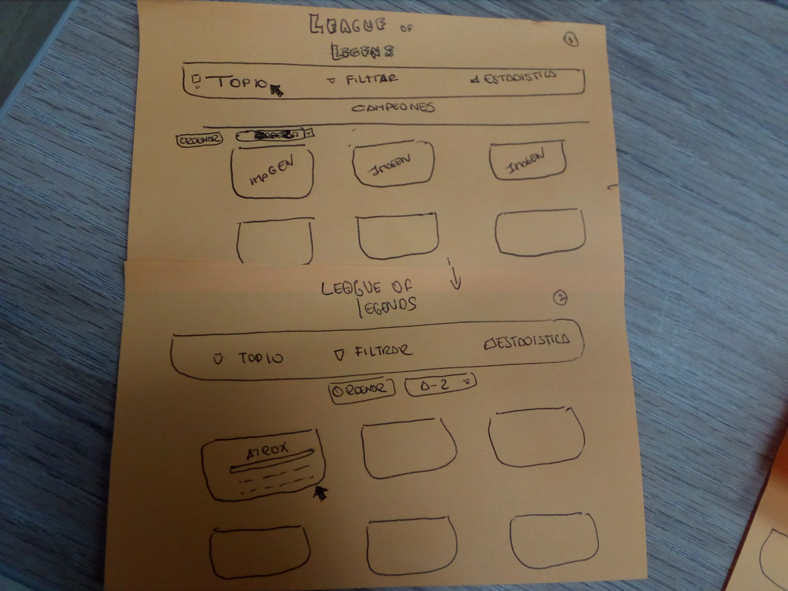
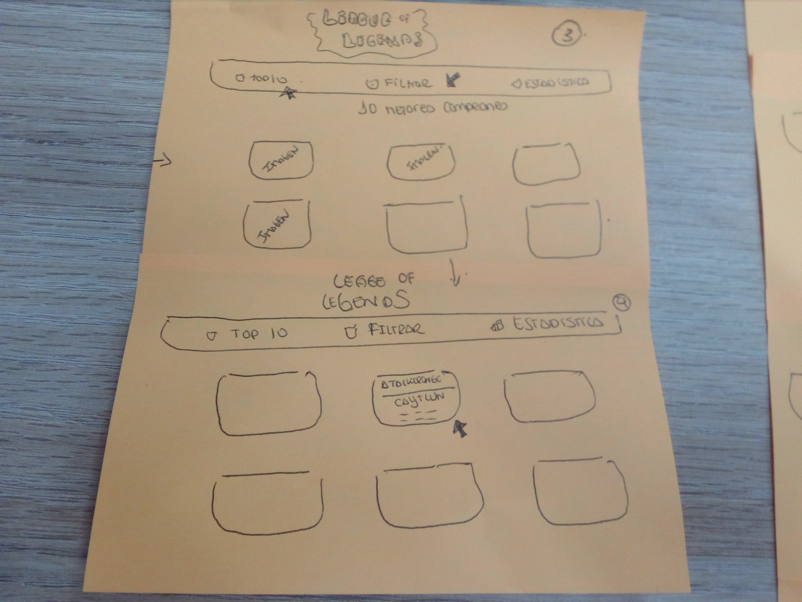
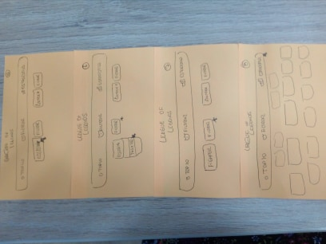
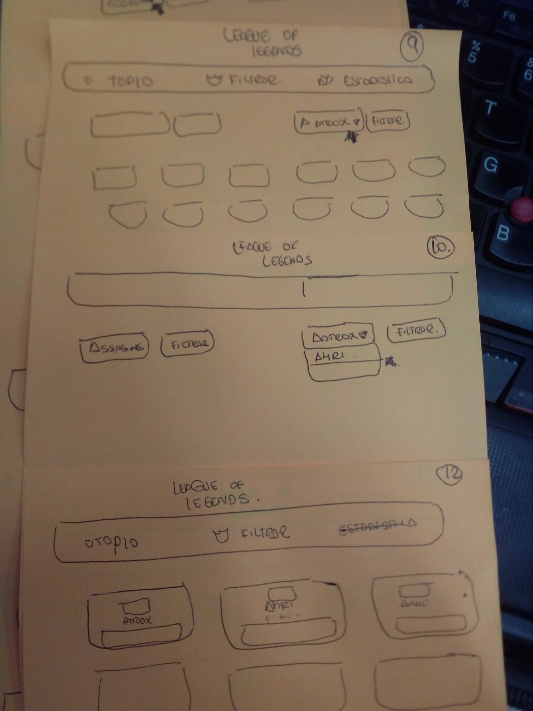
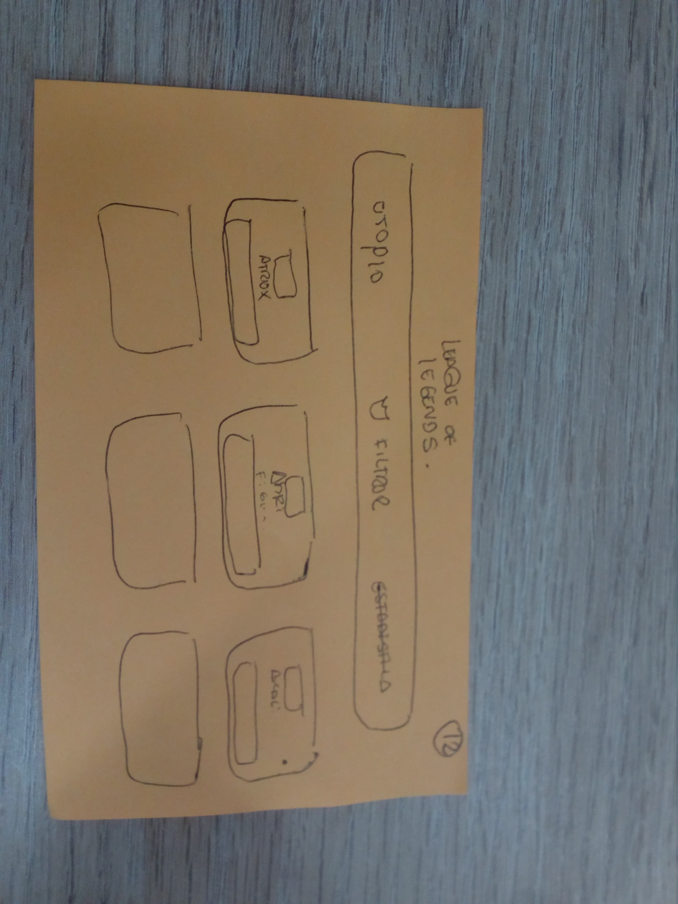
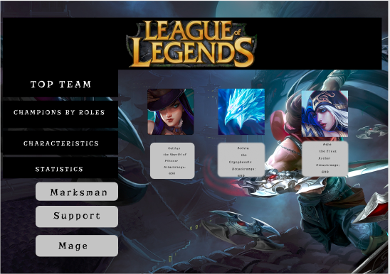
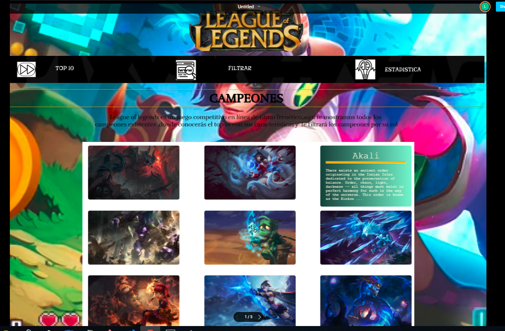

# Data Lovers
* [Definición del producto](#Definición-del-producto)
* [Historias De Usuario](#Historias-De-Usuario)
* [Prototipo de Baja Fidelidad](#Prototipo-de-Baja-Fidelidad)
* [Prototipo de Alta Fidelidad](#Prototipo-de-Alta-Fidelidad)

***
# Definición del producto
***
este proyecto se trata de crear una página amigable donde facilite al usuario que juega league of legends en poder encontrar y elegir sus mejores campeones según su preferencia, para ello hemos entrevistado aproximadamente a 10 usuarios,donde la mayoria ha coincidido con algunos puntos y lo hemos considerado en nuestra pagina.

* ¿Quiénes son los principales usuarios de producto?
  Los principales usuarios son aquellxs personas que utilizan el videojuego league of legends
* ¿Cuáles son los objetivos de estos usuarios en relación con el producto?
  El objetivo es que los usuarios puedan encontrar a sus campeones indicados para comenzar el juego de la manera mas facil segun su preferencia.
* ¿Cuáles son los datos más relevantes que quieren ver en la interfaz y por qué?
  Según los usuarios entrevistados nos indicaron que prefieren escoger a sus campeones según sus roles ya que les ayuda saber en que posición jugarán,
  tambien les interesaba saber sus características como su ataque,defensa,dificultad y magia poque les ayudaría escoger que mejor campeón seria mas fuerte 
  que el otro una vez que haya escogido su rol.
# Historias De Usuario
 1. yo como usuario quiero quiero que me muestre los 10 primeros mejores campeones que tengan mayor rango de ataque.
 2. yo como usuario quiero que me filtre los campeones sugún el rol que elija.
 3. yo como usuario quiero que me filtre las características (ataque,defensa,dificultad y magia) de los campeones según mi elección.
 para ello hemos realizado un sketch de baja fidelidad de como quedaría y que se necesita para lograrlo.
 # Prototipo de Baja Fidelidad
 ***
 * pantalla principal
 
 me muestra la lista de los campeones de manera ordenada alfabeticamente
 
 
 * primera historia de usuario
 al hacer click en el top 10 me muestra los 10 mejores campeones según su ataque de manera descendente.
 

 * segunda historia de usuario
 al hacer click en el botón filtrar me muestra dos botones,si hago click en el lado izquierdo me mostrará una lista de roles y al escoger uno de los roles me filtrará  todos los campeones que sean de ese rol  .
 

 * tercera historia de usuario
 al hacer click en el botón derecho me mostrará una lista de todos los nombres de los campeones y al escoger uno,aparecerá su imagen y a la espalda su información.
 
 

 * cuarta historia de usuario
 al hacer click en estadística me mostrará una lista de los campeones con su hp y armadura me indica cuanto tendrían si pasaran para cada nivel.
 
 

 
 ## Prototipo de Alta Fidelidad
 ***
 * realizamos un prototipo con ayuda de FIGMA de cómo quedaría nuestro proyecto 
 
 * primer prototipo
  
 
 
 * segundo prototipo después de testear con un usuario 
 E l usuario nos indicaba que los botones principales vayan de manera lineal,porque al momento de mostrar las imagenes de los campeones no se visualizaba bien con la posición anterior.
 
  

 * Aquí se muestra como quedaría nuestra página en desktop
 
 [prototipo-en-zeplin](https://app.zeplin.io/project/5c312ecbbae2c22086d6bdbb)
 
 [prototipo-en-figma](https://www.figma.com/proto/FhGoRtLdYJ8nH1sfVmZoTTRs/Untitled?node-id=3%3A22&scaling=min-zoom)

* Aquí se muestra como quedaría nuestra página en un celular

  

  [prototipo-en-figma](https://www.figma.com/proto/eyJVJ0RkxElf4v6qa9WanbpZ/Untitled?node-id=0%3A1&scaling=scale-down)